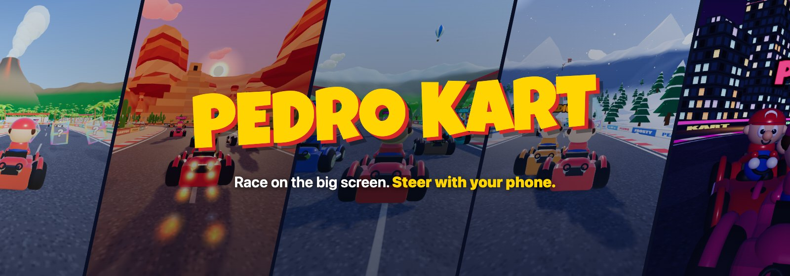

<p align="center"></p>

A kart racer that runs in a browser. The laptop or TV is the screen; everyone's phone is the steering
wheel. No app to install: scan a QR code, hold the phone sideways, tilt to steer.

Up to 4 players race 3 laps against CPU drivers on five tracks, with drifting, boost pads, and items.

## Quick start

```sh
npm install
npm start
```

1. On your computer, open **http://localhost:8080/host**. You get a room code and a QR code.
2. On each phone (same Wi-Fi), scan the QR. Safari warns about the certificate: tap
   **Show Details → visit this website**. *(The server makes its own HTTPS certificate because iOS only
   gives motion sensors to secure pages. Hosted on a real domain, this step disappears.)*
3. Tap **Join**, allow motion access, hold the phone like a wheel.
4. Press **ITEM** to start. **DRIFT** in the lobby switches tracks.

## Playing

| Phone | Keyboard | |
|---|---|---|
| Tilt | ← → | Steer |
| GAS / BRAKE | ↑ / ↓ | Go / stop, reverse |
| DRIFT (hold into a turn) | Space | Slide; sparks go white → blue → orange; let go for a boost |
| ITEM | Shift | 🍄 boost · 🍌 drop · 🐢 fire · 🔵 hits 1st place · 🚀 autopilot bullet |

Hold GAS right after the "2" for a rocket start. Items from the boxes are better the further back you are.
On the phone, **⟲ Center** re-levels the wheel and **Mode** switches to touch steering with auto-gas.

## How it works

The big screen *is* the game. Phones are controllers. The server is a switchboard.

```
   phone ──┐                       ┌──────────────────────────────────────┐
   phone ──┼── input (60/s) ─────▶ │ host browser: the whole game         │
   phone ──┘ ◀── HUD (10/s) ────── │ 60 Hz sim · AI · items · 1–4 cameras │
        │                          └──────────────────┬───────────────────┘
        │   WebRTC direct when possible               │ recordings (opt-in)
        └──── else via ────▶  server: rooms, relay, signaling, recorder
```

- **The host is authoritative.** Physics, AI, and items all run in the host's browser on a fixed 60 Hz
  tick, independent of frame rate. The server has no game logic, which is why hosting it costs nearly nothing.
- **Input takes the shortest path.** Phone and host open a WebRTC data channel through the server. On the
  same Wi-Fi it connects directly, so input never leaves the room (~1–10 ms). It's sent unordered with no
  retries, and sequence numbers drop stale packets, so a lost packet never delays newer input. If a
  network blocks device-to-device traffic, input falls back to the server relay automatically. The lobby
  shows each player's path (⚡ direct / ☁︎ relay) and latency.
- **Tilt is one angle.** Steering is the direction of gravity in the screen plane, zeroed to the nearest
  90°. That works in either landscape orientation and doesn't care about platform sign conventions.
- **Everything lives in track coordinates.** A track is a closed spline sampled at 1,600 points. Physics,
  walls, lap counting, CPU steering, and item placement all work in "distance along, offset across".
- **CPU drivers** chase a point ahead on the racing line, drift through bends, and rubber-band toward
  the humans so races stay close.
- **Split screen** renders one camera per player into its own viewport, re-aiming the shadow map for each.

## Tracks

| | |
|---|---|
| **Mushroom Circuit** | Grandstands, bunting, giant mushrooms, hot-air balloons |
| **Coconut Coast** | Sandbar lighthouse, lagoon, smoking volcano, animated sea |
| **Sunset Canyon** | Layered mesas, a pyramid against the sun, a ribcage over the road |
| **Frosty Peaks** | Lodge, gondola, frozen lake, falling snow |
| **Neon City Nights** | Neon arch tunnel, skyline, ferris wheel, suspension bridge |

A track is one file in `public/maps/`: control points, item rows, boost pads, a theme (colours, lighting,
props), and optional hooks for custom terrain and decorations. New files appear in the lobby on reload.

```sh
node tools/check-map.mjs public/maps/mytrack.js                 # corner radius, overlaps, straight start
node tools/shoot.mjs --map mytrack --top --lobby --at 3,10,20   # bot races it, screenshots → shots/
```

## Training AI drivers

Races are recorded for behavioral cloning. That's why the simulation runs on a fixed tick. Each file
in `data/races/` is gzipped JSON lines:

- A **meta** line with the roster, map, physics constants, and the names of every field.
- One **tick** line per step. It holds the full world state, and for each human the 100-number
  observation they saw and the input they pressed.
- An **end** line with the results.

`observe()` in `public/main.js` defines what a driver sees. The same function will feed a trained policy
in-game, so training and deployment can't drift apart.

```sh
uv run ml/load_races.py --min-finish --map circuit   # → data/bc_dataset.npz (obs, act, episodes)
```

Only players who tick **"share my driving"** on their phone are recorded. That's on by default locally
and off when hosted. Everyone else appears only as a kart position.

## Hosting it

Set `PUBLIC_URL` and the same server runs as a website. It becomes one HTTP listener behind your
platform's HTTPS, join links use your domain, and there's no certificate warning. Recording stays off
unless you set `RECORD=1`.

```sh
brew install flyctl && fly auth login
fly launch --no-deploy --copy-config    # set app name + PUBLIC_URL in fly.toml
fly deploy && fly scale count 1
```

Anyone opens your URL and clicks **Host**; phones scan the QR or type the code. Rooms live in memory, so
run exactly one machine until rooms are routed across instances.

## Security

**What's handled**
- Phones can only talk to their own room's host, and hosts only to their own phones.
- Room tokens let a reloaded host reclaim its room; guessing a code doesn't.
- All input is size-capped and rate-limited:
  - messages per socket
  - connections per IP
  - room creation and bad join codes per IP
  - one WebRTC offer per second per player
- Recordings are capped per race, with one active per room.
- Names are sanitized on the server and escaped on screen.
- Malformed requests get a 400 instead of crashing the process.
- Static files are confined to their folder.
- Pages ship CSP, `nosniff`, `no-referrer`, and `frame-ancestors 'none'`.
- The HTTPS private key, recordings, and screenshots are git-ignored.

**What to know**
- **Room codes are for convenience, not secrecy.** There are 160k of them, rate-limited. Anyone
  with the code can join, and there's no kick or lock yet.
- **The host decides what gets recorded.** Treat recordings from other people's hosts as untrusted data.
- **CSP still allows inline scripts,** because the pages are single files.
- **Local mode listens on your whole network.** Anyone on the same Wi-Fi can open a room.

## Layout

```
server.js             rooms, relay, WebRTC signaling, recorder, static files
public/home.html      landing page (host / join)
public/index.html     the game screen      public/main.js    sim, items, AI, cameras, HUD, recording
public/controller.html  the phone          public/world.js   builds a level from a map's theme
public/kart.js · fx.js · icons.js          karts and drivers, particles, item art
public/maps/*.js      one file per track   tools/            map checker, screenshot bots
ml/load_races.py      recordings → training arrays
```

*A fan project, not affiliated with Nintendo.*
