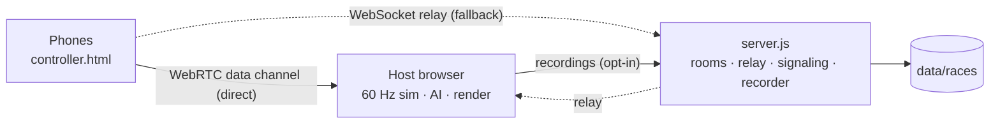

<p align="center"></p>

<p align="center">
  <a href="https://github.com/plarotta/pedrokart/actions/workflows/ci.yml"></a>
  <a href="LICENSE"></a>
  
</p>

**Pedro Kart** is a multiplayer kart racer that runs in the browser. A laptop or TV is the screen and
phones are the controllers: scan a QR code, tilt to steer. Nothing to install.

It's also a data-collection rig. Races are recorded at a fixed 60 Hz as (observation, action) pairs for
training AI drivers by behavioral cloning.

## Quick start

```sh
npm install && npm start        # Node 22+
```

1. Open **http://localhost:8080/host** on the computer. It shows a room code and a QR code.
2. On each phone, on the same Wi-Fi, scan the QR.
3. Accept the certificate warning (**Show Details → visit this website**). The server makes its own
   HTTPS certificate because iOS only gives motion sensors to secure pages.
4. Tap **Join** and hold the phone like a wheel. **ITEM** starts; **DRIFT** changes track in the lobby.

| Phone | Keyboard | |
|---|---|---|
| Tilt | ← → | Steer |
| GAS / BRAKE | ↑ / ↓ | Drive / brake |
| DRIFT (hold into a turn) | Space | Drift; release after blue or orange sparks for a boost |
| ITEM | Shift | Mushroom · banana · shell · blue shell · bullet |

## Architecture



| Decision | Why | Trade-off |
|---|---|---|
| **Host browser is authoritative**; the server has no game logic | One simulation, nothing to reconcile, near-zero hosting cost | Host hardware sets frame rate (`/host?quality=low` exists); players share one screen |
| **Fixed 60 Hz tick**, decoupled from rendering, with up to 0.2 s catch-up | Same input, same result, which clean training data needs | Very slow hosts eventually slow down rather than skip |
| **Input over an unordered, no-retransmit WebRTC channel**, with sequence numbers and a WebSocket fallback | Only the latest input matters, so drops never delay it; LAN traffic stays in the room (~1–10 ms) | Client-isolated Wi-Fi falls back to the relay; no TURN yet |
| **Button presses latched** until sent, then until a tick sees them | A tap faster than a send interval or a slow host frame would otherwise vanish | — |
| **Tilt = gravity's angle in the screen plane**, zeroed to the nearest 90° | Works in either landscape orientation on any platform, with no calibration | The phone can't be held flat |
| **Everything in track coordinates** (a spline sampled at 1,600 points) | Physics, walls, laps and AI are cheap and robust without a physics engine | Flat tracks only |
| **Maps are data plus hooks** (a theme merged over defaults, plus `terrain` / `decorate`) | New tracks without engine changes | Maps are trusted code |
| **Rooms in memory** | Needs no coordination | One instance until rooms are routed |

| Path | Responsibility |
|---|---|
| `server.js` | Rooms, relay, signaling, recorder, rate limits, headers |
| `public/main.js` | Game loop, physics, items, AI, HUD, networking, `observe()` and recording |
| `public/world.js` · `track.js` | Level builder from a map theme · spline and track-space queries |
| `public/kart.js` · `fx.js` · `icons.js` | Models · particles · item art |
| `public/maps/*.js` | One file per track |
| `public/controller.html` | Phone: tilt, buttons, WebRTC offerer |
| `ml/load_races.py` | Recordings → `.npz` dataset |
| `tools/` | `check-map`, screenshot bots, `ci-smoke` end-to-end test |

<details>
<summary><b>Protocol</b></summary>

**Connecting.** Both sides open a WebSocket to `/ws`:
- **Host:** `?role=host`, plus `room` and `token` to reclaim its room after a reload.
- **Phone:** `?role=controller&room=CODE&id&name&rec=0|1`.

Every message is scoped to one room.

| Direction | Message |
|---|---|
| server → host | `room {code, token, joinUrl}` · `join` · `leave` · `msg {pid, m}` |
| host → server | `toPlayer {pid, msg}` · `rec {op: start\|rows\|end}` |
| phone → host | `in {q, s, g, b, d, i}` · `ping` · `rtt` · `rtc {sdp\|cand}` |
| host → phone | `hud` (10 Hz) · `hit` · `pong` · `rtc` |
| server → phone | `status {host}` · `error {no-room\|room-full\|room-closed\|rate-limited}` |

Input is sent on change and at least every 100 ms. Once the data channel opens, `in`, `ping` and `pong`
move to it; signaling stays on the relay.
</details>

## Training data

A race is recorded when a player opts in (**"share my driving"**). That's on by default locally and off
when hosted. Each file in `data/races/` is gzipped JSONL:

- **`meta`:** roster, map, physics constants, and the names of every field.
- **One `tick` per step:** world state; a 100-float observation per opted-in human, taken before the
  step; actions; who controlled each kart.
- **`end` / `abort`:** results, or why the recording stopped.

`observe()` is the single definition of what a driver sees, for training and for in-game policies.
Layout changes bump `OBS_VERSION`.

```sh
uv run ml/load_races.py --map canyon --min-finish     # → data/bc_dataset.npz
```

## Tracks

**Mushroom Circuit** · **Coconut Coast** · **Sunset Canyon** · **Frosty Peaks** · **Neon City Nights**

To add one, create a file in `public/maps/`, then check it:

```sh
node tools/check-map.mjs public/maps/mytrack.js     # radius ≥ 22 m, no overlaps, straight start, flat road bed
node tools/shoot.mjs --map mytrack --top --at 3,10,20
```

## Development

| Command | |
|---|---|
| `npm start` | Local server (HTTP :8080, HTTPS :8443) |
| `npm run lint` · `npm run check-maps` | Syntax check · track validation |
| `npm test` | Headless end-to-end run (see below) |

`npm test` covers:
- joining a room, racing, and firing every item
- loading every map
- probing the security fixes
- building a dataset from the recording

`SMOKE_CPU_THROTTLE=8` simulates a slow CI runner.

CI ([`ci.yml`](.github/workflows/ci.yml)) runs on every push and PR:
- **test:** lint, track checks, and the smoke test.
- **docker:** builds the image and checks it serves.
- **deploy:** ships `main` to Fly.io once both pass.

## Deployment

`PUBLIC_URL` switches to hosted mode:
- one HTTP listener behind the platform's TLS
- join links on your domain
- recording off unless `RECORD=1`

```sh
fly launch --no-deploy --copy-config && fly deploy && fly scale count 1
```

Add a `FLY_API_TOKEN` repo secret to deploy `main` on every green build.

## Security

**Threat model.** Anyone can create rooms, and anyone with a code can join. Phones and hosts are
untrusted; maps are trusted code.

**What's covered**
- **Isolation:** messages are scoped to their room server-side.
- **Room reclaim:** needs a 128-bit token; the code alone isn't enough.
- **Rate limits:** per-socket message rates, per-IP connection and room-creation limits, bad-code
  limits, and message-size caps.
- **Recordings:** capped per race, one active per room.
- **XSS:** input is validated and escaped.
- **Headers:** CSP and `frame-ancestors 'none'`.
- **Crash-proofing:** bad requests get a 400.
- **IPs:** forwarded headers are only trusted in hosted mode.
- **Privacy:** players who don't opt in are recorded as positions only.

**Accepted risks**
- Room codes are guessable by design (160k, rate-limited), with no kick or lock.
- A host controls its own recordings.
- Inline scripts are allowed.
- Local mode is open to your LAN.

## Roadmap

TURN fallback · multi-instance room routing · recordings to object storage · kick and lock ·
trained policies as CPU drivers · audio · elevation

## License

[MIT](LICENSE), covering the code, not third-party trademarks. An independent fan project, not
affiliated with Nintendo.
